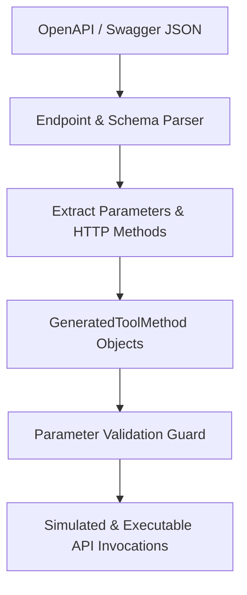

# GenPark Autonomous OpenAPI Tool Generator Skill

OpenAPI 3.0 specification parser and Python tool class generator with schema parameter validation.

Discover more at [GenPark](https://genpark.ai) and the [GenPark MCP Catalog](https://genpark.ai/mcp).

## Features
- Compliant with OpenAPI 3.0 and Swagger 2.0 path definitions.
- Automatic parameter requirement enforcement.
- Pure Python standard library.
